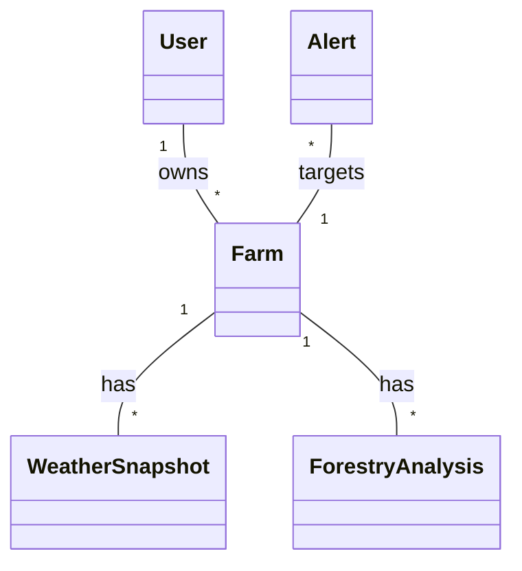
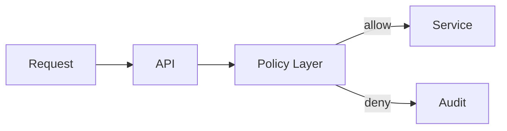

# Architecture

This document provides a detailed architecture overview for AgroInsight AI, including domain models, system boundaries, data flow, background jobs, caching, logging, and operational considerations.

## System Overview

AgroInsight AI is a modular platform composed of:

- **Frontend (Next.js)**: UI and experience, utilizing server and client components.
- **API Layer**: Next.js API routes that orchestrate domain services.
- **Service Layer**: Business logic and policy enforcement.
- **Repository Layer**: Database access via Drizzle ORM.
- **Background Workers/Cron**: Data ingestion, snapshots, and analytics evaluation.
- **External Systems**: WeatherAI, imagery providers, and notification channels.

### System Diagram

```mermaid
flowchart LR
  F[Frontend] -->|API Calls| API[API (Next.js)]
  API --> S[Service Layer]
  S --> R[Repository (Drizzle)
Postgres]
  S --> E[External APIs
WeatherAI, Imagery]
  S --> J[Background Jobs]
  J --> R
  R -->|events| OL{Audit Logs}
```

## Domain Model

- **User**: Authentication identity, roles, and permissions.
- **Organization**: Multi-team grouping for enterprise support.
- **Farm**: Core entity representing agricultural land, including plots and sensors.
- **WeatherSnapshot**: Time-series meteorological data captured for farm coordinates.
- **ForestryAnalysis**: Results from satellite imagery analysis, canopy cover, and change events.
- **Alert**: Rule-based alerts with evaluation history, status, and notifications.
- **AnalyticsReport**: Derived KPIs and aggregations for decision support.

### Relationships



## Authentication Architecture

- Implemented using **Auth.js** (formerly NextAuth.js).
- Supports multiple providers (Email, Google, etc.).
- Session handling uses secure, encrypted cookies.
- Middleware handles initial session verification for protected routes.

## RBAC Architecture

- **Roles**: Admin, Manager, Analyst, Operator.
- **Policy Layer**: Centralized authorization logic that maps roles to allowed actions.
- Granular resource-level checks (e.g., ensuring a user can only access their own farms).



## Farm Domain

- Geospatial management of farm boundaries using GeoJSON.
- Integration with local sensors for real-time field data.
- Metadata tagging for crop types and soil conditions.

## Weather Domain

- **Ingestion**: Scheduled snapshots per farm via WeatherAI API.
- **Storage**: Optimized time-series storage in PostgreSQL.
- **Evaluation**: Historical comparison to detect anomalies.

## Forestry Domain

- Periodic satellite imagery analysis (NDVI, canopy density).
- Automated change detection for deforestation or growth monitoring.

## Alerts Domain

- User-defined rules with configurable thresholds.
- Evaluation engine runs in background to check conditions against fresh data.
- Multi-channel notification pipeline (In-app, Email, SMS).

## Analytics Domain

- Batch processing of raw data into materialized views for performance.
- Aggregation of weather and forestry metrics into actionable KPIs.

## Audit Domain

- Immutable logs capturing every significant state change.
- Includes actor, action, timestamp, and before/after snapshots.

## Database Architecture

- **PostgreSQL (Neon)**: Serverless-friendly relational database.
- **Drizzle ORM**: Type-safe schema definition and query building.
- **Migrations**: Versioned SQL migrations for schema evolution.

## Repository Pattern

- Decouples business logic from data access.
- Repositories return clean DTOs, avoiding leak of ORM-specific logic to services.

## Service Layer

- Coordinates multiple repositories and external clients.
- Enforces business rules and data integrity.

## Background Jobs

- **Vercel Cron**: Triggers for scheduled tasks.
- **Serverless Functions**: Execution environment for jobs.
- **Queueing**: Reliable processing of long-running tasks.

## Caching Strategy

- **SWR/TanStack Query**: Client-side caching and revalidation.
- **Redis (Future)**: Shared server-side cache for hot data.

## Logging Strategy

- **Structured Logging**: Using Pino for machine-readable logs.
- **Trace IDs**: Correlation of logs across different system layers.

## Error Handling Strategy

- Standardized error response format for APIs.
- Custom domain exceptions for specific business logic failures.

## Testing Strategy

- **Unit**: Individual services and logic.
- **Integration**: API endpoints and database interactions.
- **E2E**: Critical user journeys using Playwright.

## Scalability Considerations

- Stateless API design for horizontal scaling.
- Database connection pooling for high-concurrency serverless environments.
- Materialized views for complex analytics queries.

## Tradeoffs

- **Next.js Modular Monolith**: High developer velocity but requires discipline to maintain module boundaries.
- **Serverless**: Cost-effective and scalable but introduces cold-start considerations.

## Future Evolution

- Transition to event-driven architecture for real-time alerts.
- Integration with more IoT sensor providers.
- Advanced AI models for yield prediction.
