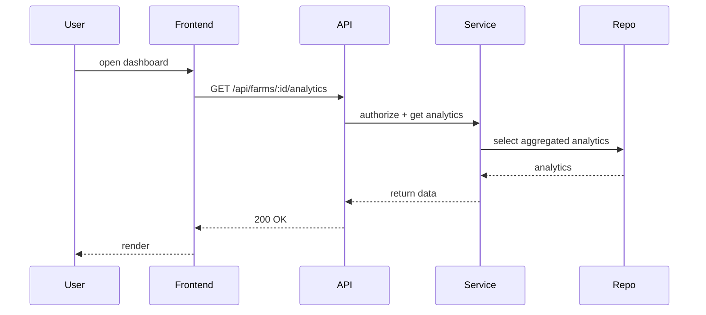

# Architecture - AgroInsight AI

## System Overview

AgroInsight AI is organized around clear domains: Users, Farms, Weather, Forestry, Alerts, Analytics and Audit. The system is a modular, feature-first monolith where frontend and backend live in the same repository and communicate via Next.js API Routes.

Key runtime flows:

- Snapshot ingestion: External WeatherAI → ingestion job → weather_snapshots table
- Alert evaluation: Snapshot → AlertService evaluates rules → alert_events created → audit logged
- Analytics derivation: Periodic background jobs aggregate snapshots into analytics tables

## Domain Model (high level)

- User: identity, roles, permissions
- Farm: metadata, location, sensors
- WeatherSnapshot: timestamped metrics (temp, humidity, wind, rainfall...)
- AlertRule: metric, operator, threshold, active, farmId
- AlertEvent: ruleId, triggeredValue, status
- ForestryRecord: canopy metrics, NDVI, change events
- Analytics: derived KPIs and aggregated time-series

## Authentication Architecture

- Auth.js handles sign-in, sessions and provider integrations.
- NextAuth is configured as the single source of truth for sessions used by API and UI.

## RBAC Architecture

- Policy-based authorization layered into API handlers.
- Roles are coarse-grained (admin, manager, operator, analyst) and policies implement finer-grained checks (resource ownership, farm-scoped access).

## Farm Domain

Farming is the primary scope: farms own sensors, snapshots, rules and analytics. Farm-level operations are scoped by farmId in database queries and validated via policy checks in the service layer.

## Weather Domain

- Weather snapshots are stored as normalized rows with metrics typed and indexed by (farm_id, timestamp).
- Snapshots are the canonical source for alerting and analytics derivation.

## Forestry Domain

- Forestry data stores per-plot canopy metrics and time-series imagery-derived scores (NDVI, LAI).
- Change-detection runs as background jobs to detect canopy loss and trigger administrative alerts.

## Alerts Domain

- AlertRules define simple threshold checks (>, <, >=, <=, ==) over metrics.
- AlertService evaluates rules per snapshot and inserts AlertEvents when conditions are met.
- AlertEvents are audited and create notifications for downstream systems.

## Analytics Domain

- Analytics jobs run periodically to aggregate snapshots (hourly/daily) into KPI tables.
- Aggregations are append-only; derived tables are re-computable from raw snapshots.

## Audit Domain

- Immutable audit logs record CRUD for critical entities and security events. Stored with timestamps, actor id, and metadata.

## Database Architecture

- PostgreSQL (Neon) is used with normalized tables and indices for time-series queries.
- Key tables: users, farms, weather_snapshots, alert_rules, alert_events, forestry_records, analytics_{daily,hourly}, audit_logs.

### Example schema notes

- `weather_snapshots` uses JSONB for optional metrics but keeps commonly queried fields (temp, humidity, rainfall) as columns for indexing.
- Time partitioning or hypertables (TimescaleDB) are optional future improvements for massive retention.

## Repository Pattern

- Repositories abstract DB access using Drizzle ORM. Repositories expose typed operations (e.g., `weatherRepository.insertSnapshot`, `alertRepository.findActiveByFarm`).

## Service Layer

- Services contain business logic and orchestrate repositories, external clients and policy checks. They are side-effecting and call auditLogger and logger where relevant.

## Policy Layer

- Policy functions encapsulate authorization rules and are invoked at API boundaries and in services when resource-scoped decisions are required.

## Background Jobs

- Two execution models supported:
  - Lightweight scheduled jobs using Vercel Cron that call internal API routes
  - Worker-based jobs (recommended for heavy processing) using an external worker platform

- Jobs: snapshot ingestion, alert evaluation, forestry change-detection, analytics derivation, data retention cleanup.

## Caching Strategy

- Use HTTP caching (Cache-Control) on read endpoints where data is eventually consistent.
- In-memory caches (Lru or Redis) for expensive lookups like farm metadata or computed aggregates.

## Logging Strategy

- Pino for structured logs. Logs include request context (user, request id, farmId) when available.
- Separate log levels for audit (info) and security (warn/error). Persist logs to centralized collector in production.

## Error Handling Strategy

- API routes use a centralized error middleware that maps errors to HTTP codes and formats responses as `{ error: { code, message, details? } }`.
- Services throw domain-specific errors for policy violations and validation failures.

## Testing Strategy

- Unit tests for services and repositories with mocked DB.
- Integration tests run against a disposable test DB (Docker/Neon ephemeral).
- Contract tests validate API responses and schemas.
- E2E tests cover critical user flows with seeded fixtures.

## Scalability Considerations

- Read scaling: read replicas for analytics workloads, separate analytics DB if needed.
- Write scaling: partition weather_snapshots by time or move to a dedicated timeseries store.
- Background processing: migrate heavy jobs to dedicated workers and queue system (e.g., BullMQ or Temporal).

## Tradeoffs

- Monolith (feature-first) reduces operational complexity and accelerates development, at the cost of requiring careful modularization as the app grows.
- Using Next.js API routes simplifies deployment to Vercel but can be limited for heavy background work.

## Future Evolution

- Introduce an event bus (Kafka or Pulsar) for async integrations and decoupling.
- Move time-series retention to TimescaleDB or a purpose-built TSDB for scaling.

## Diagrams

```mermaid
flowchart LR
  User[User] -->|UI| Frontend[Next.js Frontend]
  Frontend -->|REST| API[API Routes]
  API --> Service[Service Layer]
  Service --> Repo[Repository (Drizzle)]
  Repo --> Postgres[(PostgreSQL)]

  Farm --> Weather
  Weather -->|snapshots| AlertRules
  AlertRules -->|create| AlertEvents

  subgraph Background
    Scheduler[Vercel Cron / Scheduler] --> Ingest[Snapshot Ingestion]
    Ingest --> Repo
    Scheduler --> Analytics[Analytics Jobs]
  end
```


